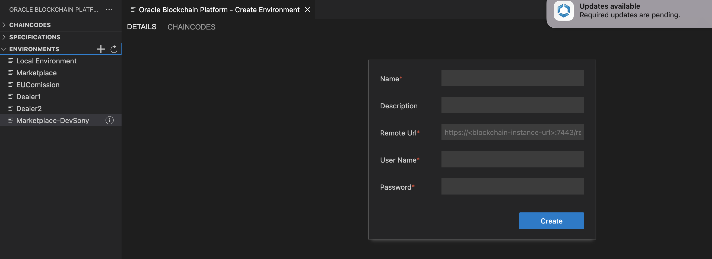
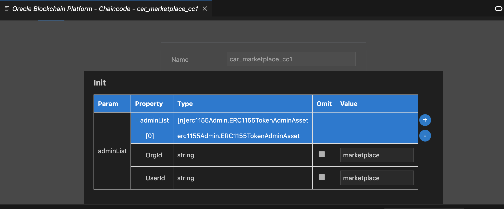
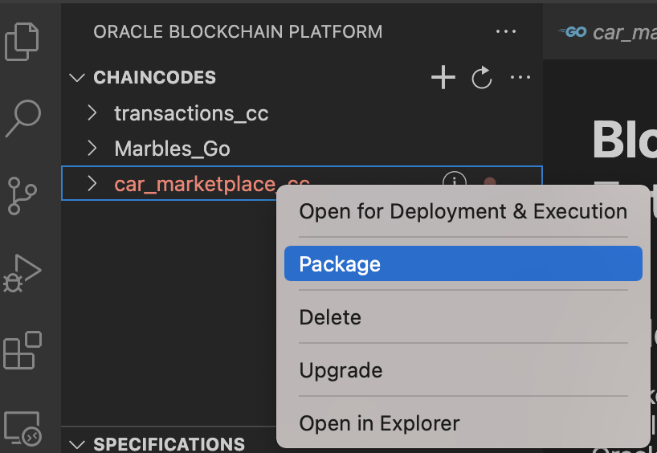
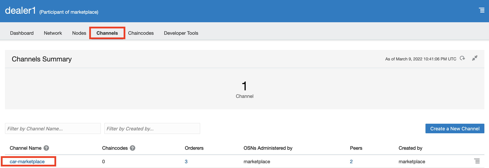
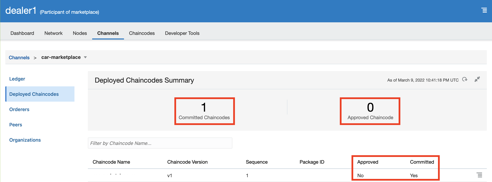
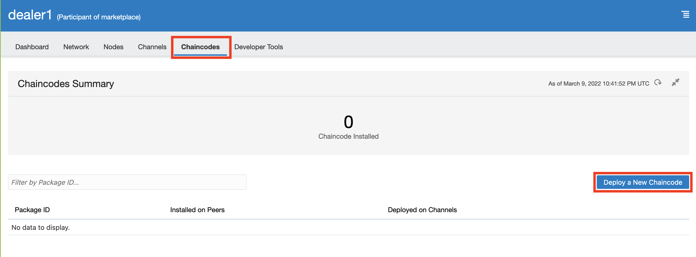
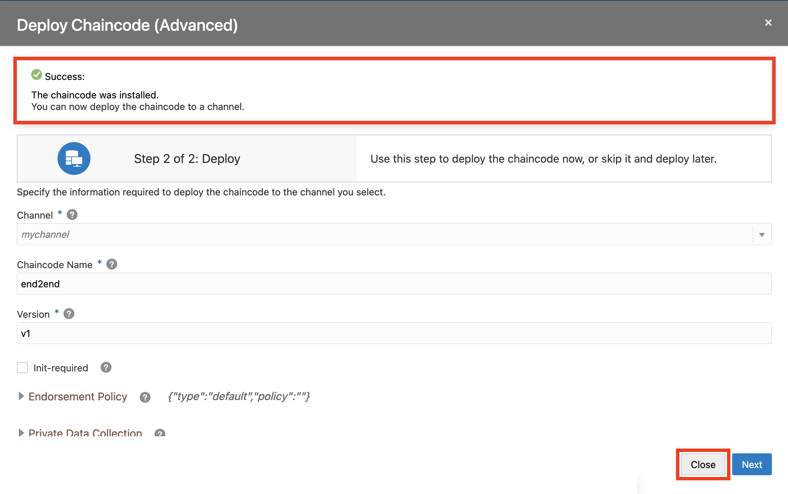
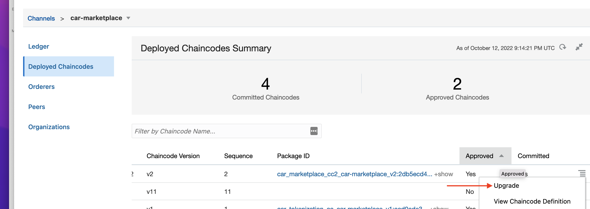
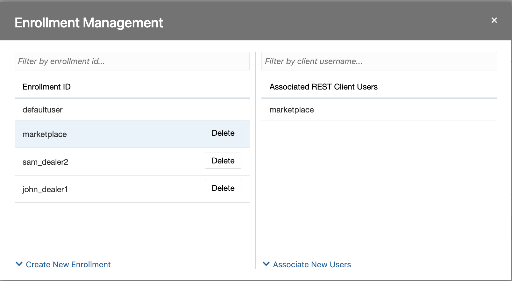

# Deploy, Test Smart Contracts using Blockchain App Builder & Oracle Blockchain Admin Console

## Introduction

Blockchain App Builder is a tool set that assists Oracle Blockchain Platform users with rapid development, testing, debugging, and deployment of chaincode on Oracle Blockchain Platform networks. Blockchain App Builder is accessible through Visual Studio Code as an extension and through a lightweight command line interface. Blockchain App Builder to manage the complete life cycle of a token. Developers can tokenize existing assets and automatically generate token classes and methods to use for token lifecycle management.

*Estimated Lab Time:* 25 minutes

### About OBP Tokenization

1. Tokenization is a process where physical or digital assets are represented by tokens, which can be transferred, tracked, and stored on a blockchain. By representing assets as tokens, you can use the blockchain ledger to establish the state and ownership of an asset and use standard blockchain platform functions to transfer ownership of an asset.

2. You can use the Blockchain App Builder Extension to manage the complete life cycle of a token. You can tokenize existing assets and automatically generate token classes and methods to use for token lifecycle management.

3. This lab incorporates tokenization, enabling our car marketplace administrator to initialize, mint, and transfer fungible, fractional tokens to and from `john_dealer1` and `sam_dealer2`.

4. The tokenization feature uses an account/balance model to represent tokenized assets as balances in accounts - `john_dealer1` and `sam_dealer2`. The balance of their accounts is tracked globally, to ensure that transaction amounts are valid when buying/selling cars. The on-hold balance and transaction history are also tracked.

5. Feel free to learn more about [Tokenization support with OBP](https://docs.oracle.com/en/cloud/paas/blockchain-cloud/usingoci/tokenization-support.html).

### Objectives

In this lab, you will:
* Scaffold Project, Generate Chaincode, Deploy Smart Contracts locally, Test &  Debug Smart Contract, Package & Deploy Smart Contracts to OBP

### Prerequisites
This lab assumes you have:
- An Oracle Cloud account
- You have completed:
    - Lab: Prepare Setup (*Free-tier* and *Paid Tenants* only)
    - Lab: Environment Setup
    - Lab1: Create a Blockchain Network connecting 3 Organizations & Configuring Oracle Blockchain App Builder
    
## Task 1: Deploy Car Marketplace Smart Contract (Chaincode) to Founder Instance (Marketplace) from Blockchain App Builder

  Now that we have configured completed Lab1, let's connect to the cloud instances to deploy and test the chaincodes.

1. In the OCI services menu, select 'Developer Services' and click on 'Blockchain Platform'

2. Ensure that the right **Compartment** is selected and click on the 'Marketplace' founder instance.

3. Click the 'Service Console' -->Go to Markplace Blockchain Instance Dashboard.

4. Navigate to Nodes tab and copy the rest proxy url.

  

5. Go to VSCode AppBuilder and Hover over the **Environments** pane, click on the '+' button, and fill out the form as follows:
    - Add a **Name** (e.g. Marketplace).
    - Optionally, add a **Description**.
    - Paste the **Marketpalce rest proxy url from step4** of your marketplace founder instance.
    - Enter your **User Name** (e.g. 'username') and then enter the **Password**.

  

6. Once all the information is captured from admin console and configured in AppBuilder Environment setup, let's deply the chaincode. Change the target environment from 'Local Environment' to 'Marketplace' in App Builder, add init parameters (e.g:'OrgId': marketplace, 'UserId':marketplace ) Obtain the channel name as set in *Lab1 - Task 5 (e.g:car-marketplace)* 


  
  

## Task 2: Import Car Marketplace chaincode package from App Builder

1. In Visual Studio Code, click on the **O** icon on the left-hand menu to use the Blockchain App Builder Extension.

2. Hover over the **Chaincodes** pane, Right Click on the chaincode to be packaged --> Select the directory to save the chaincode package file.

  

## Task 3: Install and Deploy Marketplace chaincode package onto Participant Instances using Oracle Cloud Blockchain Platform Console(dealer1 & dealer2)

  To install and re-deploy the chaincode on partner instances, use the package in Task3 (above) and then approve the chaincode definition from the partner instances (in this case, 'dealer1' and 'dealer2').

1. Access the 'Service Console' for the 'dealer1' instance.

  

2. Click the **Channels** tab and then the 'car-marketplace' channel.

  

3. Select on 'Deployed Chaincodes' on the left-hand navigation pane. You will see that 1 chaincode has been committed to the channel, but has not yet been approved by the participant organization.

  

4. Now click the **Chaincodes** tab and then 'Deploy a New Chaincode'

  

5. Select 'Advanced Deployment.'

  

6. Fill out the form as follows:
    - For **Package Label**, open up the 'Service Console' for the 'Marketplace' founder instance, click the **Chaincodes** tab, and copy the text as shown. You may use `car_marketplace_cc_car-marketplace_v1`, or any other name, but make sure to use the same name when repeating these steps for 'dealer2'

    

    - Keep 'GoLang' as the **Chaincode Language**.
    - Select both available peers as the **Target Peers**.
    - Upload the package .zip file you exported from the App Builder VS Code extension. We stored this in the **Samples** folder.
    - Click 'Next'

  

7. Click 'Close.' We will only be installing (not deploying) the chaincode onto the participant instances.

  

8. Now click 'Channels,' then the 'car-marketplace' channel, and navigate to 'Deployed Chaincodes' as you did in steps 3 and 4.

9. Find and click on the hamburger icon on the right of the row containing your chaincode. Select 'Approve.'

  


10. Assign the [Endorsement policy](https://docs.oracle.com/en/cloud/paas/blockchain-cloud/usingoci/specify-endorsement-policy.html) by selecting signature under the endorsement policy. Add the policy of performing an endorsement signature by one of the organizations in the network. You can add an endorsement policy when you instantiate a chaincode. An endorsement policy specifies the members with peers that must approve, or properly endorse, a chaincode transaction before it’s added to a block and submitted to the ledger. 

Now assign the endorsement policy by by selecting the signature policy and click on 'Upgrade'

    ```
    <copy>
    OR('dealer1.member','dealer2.member')
    </copy>
    ```

  

  

11. Check that the chaincode has now been approved by the current participant.

  

12. Repeat steps 1-10 for 'dealer2' instance

13. Now, Go to marketplace founder Instance --> Channels --> car-marketplace --> Deployed Chaincodes --> car-marketplace-cc2 --> Approve

  [Check Approved Field](images/2-car-marketplace-7-13.1.png)
  [Check Approved Field](images/2-car-marketplace-7-13.2.png)
  [Check Approved Field](images/2-car-marketplace-7-13.4.png)
  [Check Approved Field](images/2-car-marketplace-7-13.5.png)

## Task 4: User Enrollment - Perform on All nodes (marketplace, dealer1, dealer2)

  Oracle Blockchain Platform supports enrollments to the REST proxy. You use enrollments with token chaincodes to ensure the identities of the users completing token transactions. To do this, when you add enrollments for token use cases, specify a user ID for each enrollment (founder ID in this case), and specify one and only one user for each enrollment.

1. While logged into the marketplace founder instance, navigate to Nodes in OBP console.

2. Click on the hamburger menu besides restproxy and select 'View or manage enrollments.'
  

3. Select Create New Enrollment.

  

4. Input enrollment information. See sample enrollment as example. Enrollment user had to be created in idcs. In this example 'marketplace','dealer1','dealer2' is used. Make sure the user has REST_Client role assoicated with the Blockchain instance.
    - For marketplace Instance

  

    - For dealer1 Instance

  

    - For dealer2 Instance

  

5. Click Enroll.


## Task 5: Initialization and Issuance of Car Marketplace FiatToken

1. Click on Postman on the VNC Desktop --> Import the Marketplace Tokenization Postman collection [Marketplace Tokenization](files/Car_Marketplace.postman_collection.json?download=1) and assign variable definitions as shown.

  
  

2. Enter the collection setup variables in Postman Environment. Some sample definitions are shown below.

  

3. Open tokenization collection Marketplace_Tokenization, and run integrations as described in steps 0 – 6 by clicking Send:

    - Step 0 - Init: Called when chaincode is instantiated. Token Admin is identified by `user_id` and `org_id`.

  

    - Step 1 – Initialize Token: This method creates a token and initializes the token properties. The asset and its properties are saved in the state database. This method can be invoked only by the Token Admin of the chaincode.


  

    - Step 2 – Create(Admin User):  This method creates an account for a specified user and token. An account must be created for any user who will have tokens at any point. Accounts track balances, on-hold balances, and transation history.

  

    - Step 3 – Associate Acoount: Copy the account id  received from Step2 when creating the account in step. Substitute the accountid while associating the account as shown.

  

    - Step 4 – Add Role: This method adds a role to a specified user and token. This method can be called only by the Token Admin of the chaincode.

  

    - Minter Role: mints a quantity of tokens, which are then owned by the caller of the method.

    - Step 5 – Mint Fiat Token Tokens: This method mints batch of tokens, which are then owned by the caller of the method. The caller must have an account and the minter role.

  

## Task 6: Initialization and Issuance of Car Title Registration NFT

1. Use the same postman collection imported in Task5 --> Step 1 & 2

2. Create Dealer1, Dealer2 Accounts --> Associate Fiat Tokens to dealer accounts --> Assign Minter Roles

    - Step 5, 5.1, 6, 6.1 – Create Accounts & Associate Tokens to Car Title Registration NFT Accounts (Dealer1 Account, Dealer2 Account) for creating a Car Title NFT's to trade vehicles between dealer1 & dealer2:  These methods creates an account for a specified user and add role to trade a NFT's between dealer1 and dealer2. An account must be created for any user who will have fiat tokens at any point. Accounts are created to track Car tile NFT's for each vehicle created and traded.
    
  
  
  
  

  - Steps 7, 8 - Minter Role: mints a quantity of tokens, which are then owned by the caller of the method. This method mints tokens, which are then owned by the caller of the method. The caller must have an account and the minter role.

  
  

## Task 7: Initialize dealer1 and  dealer2 inventories

1. Use the same postman collection imported in Task5 --> Step 10 & 11

2. Initialize inventory for Dealer1 & Dealer2

  

  


You may now proceed to the next lab.

## Learn More

[Tokenization support with OBP](https://docs.oracle.com/en/cloud/paas/blockchain-cloud/usingoci/tokenization-support.html)

## Acknowledgements
* **Author** - Oracle Blockchain Product Management
* **Contributors** - Diego Morales, Lokeswara Nushisarva, Siddesh C. Prabhu Dev Ujjni, Rene Fontcha
* **Last Updated By/Date** - Rene Fontcha, July 2023
